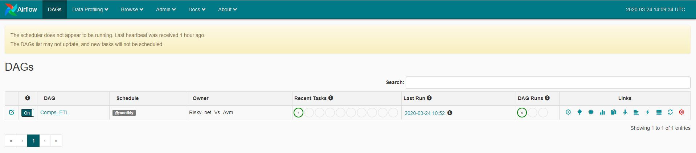

#Apache airflow Dockerfile (Build Docker Container)
## Usage
In order to run the Airflow pipeline locally using docker, the following environment variables need to be set:
1. ```DB``` - Set DB to which database you wish to use in the docker-compose.yml
2. ```PGHOST``` - The URL of the PostgresDB
3. ```PGPORT``` - Postgres Port
4. ```PGUSER``` - Postgres Username
5. ```PGPASSWORD``` - Postgres Password

I've personally modified the `sql_alchemy_conn =` variable in ```airflow.cfg``` file  from sqlite-usage to PostgreSQL.
You can modify the ```airflow.cfg``` file to your taste, but will highly suggest not to touch it 
in this project unless you know your shit :)

Once these variables are set, go to the project root dir and run :
 - ```docker-compose up comps_etl``` : names of our service to build container 
 for the first time
 
 On next runs you can simply use - ```docker-compose up```  to start service or
 - ```docker-compose up --build``` to rebuild service
 - ```docker-compose down``` to shutdown service.
 
 Now enter a UI to check at http://localhost:8080, that all run successfully. It must contain a dag file:
 
 
